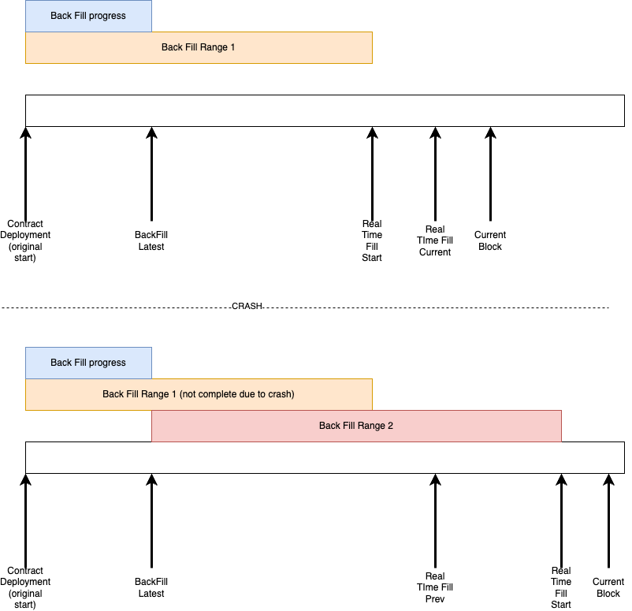
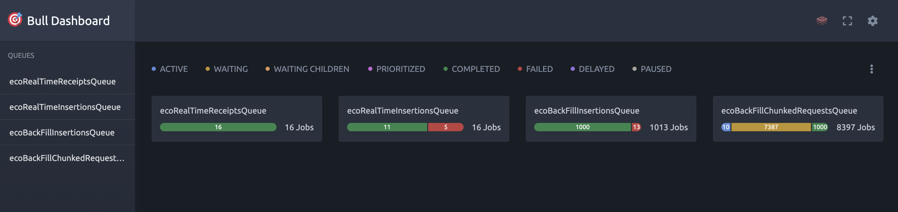
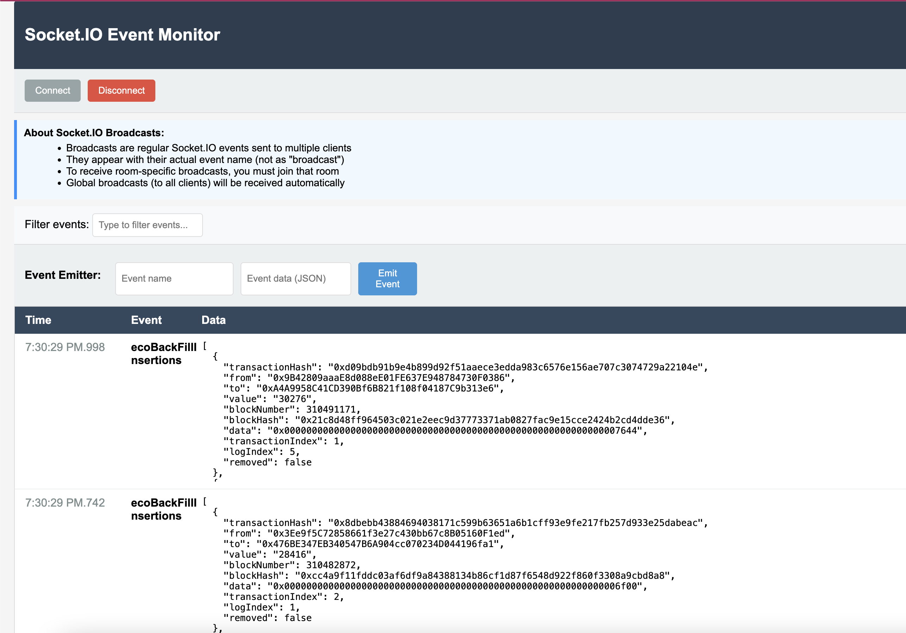

# Token Event Indexer

This is a nodeJS service that indexes a single event from a smart contract, from the start of the contract's history - its deployment block.

# Technical Design

The core technical design here was to be able to create an algorithm that would start the server by running in 2 modes:
- Backfill: Get old events from a start block to an end block.
- Real-time: Get real time events as they come in.

They key here is to handle downtime and to make sure we don't miss any blocks. On first run, the real time service starts getting events automatically, and the back fill service starts getting blocks from the specified block in `.env` to the first block seen by the real time service. If we're dealing with a low-volume contract, we wait a few minutes for a real time event, and then simply start the back-fill to the current block. (there were no events in that window anyways)

On a sequential start, the back fill starts from the last seen backfill block to the new first real time fill block or the current block.



I also opted to use a job scheduler, Bull. This allows us to do several things:
- Keep track of jobs, specially the long running backfill jobs.
- Automatic retries of failed jobs
- Rate limit the job that get the chunks from the RPC. Alchemy allows only 2000 blocks at a time.
- Allows for some parallelization in getting all the chunks to form the backfill history, to speed it up. 


# Dependencies
This software depends on the following external dependancies:
- Redis
- Postgres

# How to run
- Install dependencies by running `npm i`
- Make sure that postgres is running locally.
- Make sure that redis is running locally.
- Add the erc20 contract of choice under .env `TARGET_CONTRACT_ADDRESS`
- Add the start block for indexing under .env `BLOCK_START_NUMBER`. This is usually the contract's deployment block.
- Add both a https rpc endpoint and a ws rpc endpoint under .env `PROVIDER_URL` and `WS_URL`
- Add the port of the server under .env `REST_PORT`
- Add the database name and database schema name under .env `DB_NAME` and `DB_SCHEMA`
- If runnning in development mode locally, set `NODE_ENV` to `development` and `REDIS_USE_TLS` to `false`
- Make sure the 2 needed sql tables exist in your database. You can run the following sql command to make them:

```
CREATE SCHEMA IF NOT EXISTS indexer;

CREATE TABLE indexer.eco_erc20_transfer_events (
    transaction_hash TEXT NOT NULL,
    "from" TEXT NOT NULL,
    "to" TEXT NOT NULL,
    value TEXT NOT NULL,
    block_number INTEGER NOT NULL,
    block_hash TEXT NOT NULL,
    data TEXT NOT NULL,
    transaction_index INTEGER NOT NULL,
    log_index INTEGER NOT NULL,
    removed BOOLEAN NOT NULL,
    obtained_from TEXT,
    PRIMARY KEY (transaction_hash, log_index)
);

CREATE TABLE indexer.metadata (
    id TEXT PRIMARY KEY DEFAULT 'singleton',
    real_time_fill_start_block INTEGER NOT NULL DEFAULT 0,
    real_time_fill_latest_block INTEGER NOT NULL DEFAULT 0,
    back_fill_start_block INTEGER NOT NULL DEFAULT 0,
    back_fill_latest_block INTEGER NOT NULL DEFAULT 0,
    number_of_events INTEGER NOT NULL DEFAULT 0
);

```

- Now  you can run the server by running `node dev`

- For development and testing, I opted to use the token `0xcbb7c0000ab88b473b1f5afd9ef808440eed33bf` and started indexing at its deployment block of `272420846`. I also opted to use the Arbitrum layer 2.

# How to use

When you run the server, it will automatically start the 2 processes to caputure all events: the real time events, and the backfill events. The backfill events might take a from few hours to a day or two, depending how old the contract is and how many transfer events there are in its history.

You can hit some of the API endpoints to keep an eye on its progress. Please take a look at the swagger API endpoint at `/api-docs` for more info. These endpoints are rate limited.

Aditionally you have access to two dashboards to keep a closer look at progress:
- `/bullboard` to see information about the scheduled jobs and the progress related to them. From here you can also manually retry jobs that failed for any reason.



- `/socketClient` to see a real-time event flow of the incoming events. The socket is exposed automatically 2 ports after the one chosen in the env file. So if the server is at port 3004, the socket is at 3006.



You can stop the server at any time, and upon next start it will backfill all the events that were missed when it was off.


# Future Improvements

To make this a more userful service, I would:
- Add the ability to index from more than one contract.
- Add the ability to index more than one event from a contract. 

I would also try to speed up the indexing by doing both horizontal and vertical scaling:
- Run more instances of this software to index different ranges of blocks.
- Run on more powerful machines to be able to increase the concurrency of the Bull jobs. 
- Ability to index from more networks, not just Arbitrum.
- Connect to more providers - not just alchemy, to be able to get around rate limits. Could round-robin them.
- Clean up code a bit, refactor some parts to be more modular. Separate out the bull workers into another file.

I would also add an authentication layer to the bullboard interface.

